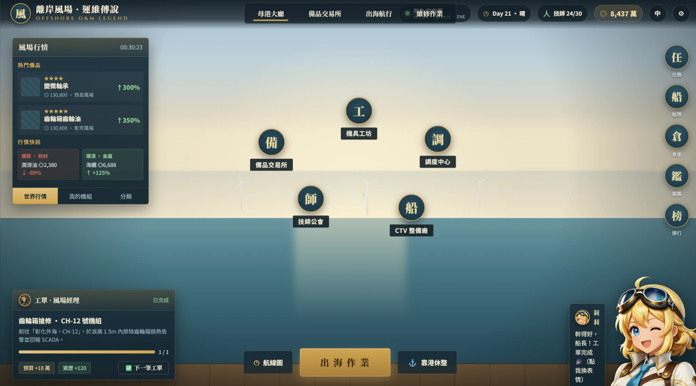
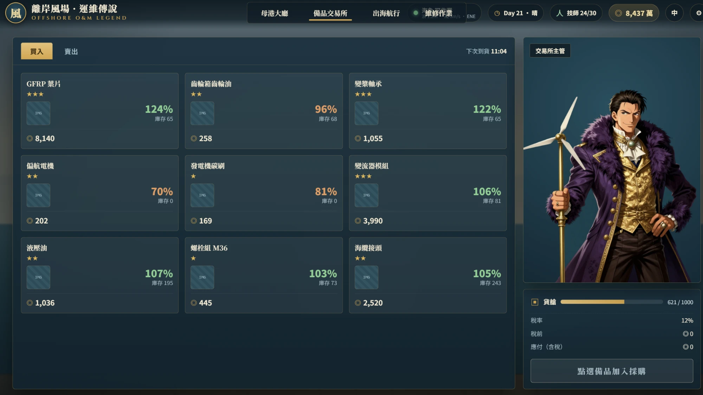
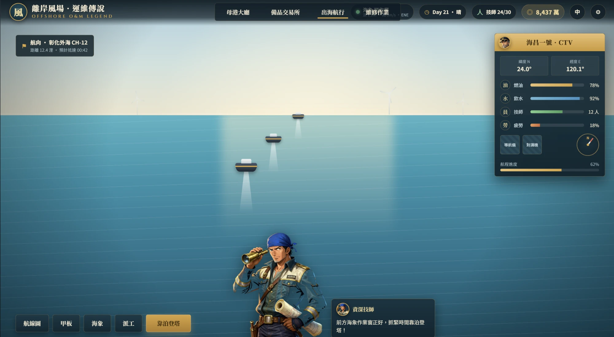
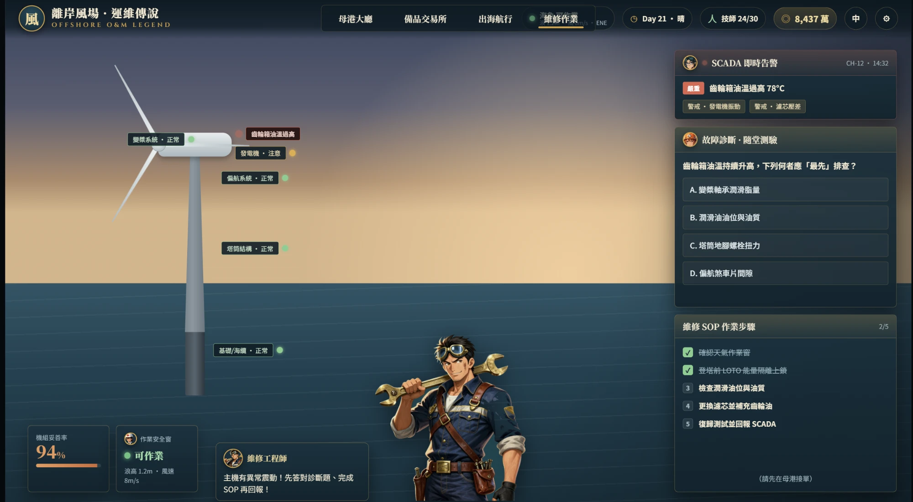

# 離岸風場・運維傳說 — Offshore O&M Legend

**English** · [繁體中文](README.zh-TW.md)

An educational, *Uncharted-Waters*-style game that reframes offshore **wind-farm Operations & Maintenance (O&M)** as a seafaring-trade adventure. Sail a CTV out to the wind farm, manage parts and the weather window, climb the turbine, diagnose faults, and learn real O&M knowledge through in-game quizzes.

> Built as a teaching tool by **DOF Lab, National Chin-Yi University of Technology (NCUT)**.

▶ **[Play online](https://dofliu.github.io/windFarm-Go/)**



## Screens
| | |
|---|---|
|  |  |
| **Parts Market** — spare-part prices & trading | **Set Sail** — CTV voyage & vessel status |
|  | |
| **Repair** — fault diagnosis quiz + SOP steps | |

## Features
- **Two-layer design** — a graded **7-mission campaign** (teacher opens it week by week) plus an always-open **Ops Center sandbox** that streams endless situations and feeds the leaderboard.
- **Four interconnected screens**: Home Port, Parts Market, Set Sail, Repair.
- **Mobilization gate** — no teleporting: repair is locked until you've assigned a vessel, a matching-discipline engineer, the required part in stock and a weather window, then sailed out (travel time + boarding delay in rough seas).
- **151-template judgment-task engine** across 7 categories (corrective / predictive / preventive / operational / weather / logistics / incident), most with trade-off choices, teaching feedback, and aid charts (trend / spectrum / radar).
- **Multi-farm operations & random events** — expand to 4 farms (unlock by budget + seniority); ~8 incident types (crew shortage, strike, delivery delay, overhaul…) fire on day-advance; **safety KPI**.
- **Fleet & crew & economy** — CTV / SOV / Jack-up vessels (jack-up mobilises for major works), hire engineers by discipline, parts with delivery lead-time & downtime cost.
- **Three background modes** — Simulation (animated CSS), Realistic (photos) and Comic (Uncharted-Waters illustrations); plus a 60° **aerial farm view**; turbines, vessels & substation rendered per scene.
- **Cloud class leaderboard** (free, no backend) via a Google Apps Script Web App with server-side validation; **nickname + class-code login**, per-user save isolation.
- **Bilingual (繁中 / English)**, character/dialogue system, Course Mode (teacher tools), procedural Web Audio SFX/BGM, 1600×900 scaling stage.

## Tech stack
React + TypeScript + Vite + Tailwind CSS. UI is pure DOM/CSS (no game engine); art is layered SVG/CSS plus transparent PNG portraits.

## Getting started
```bash
npm install
npm run dev        # http://localhost:5173
npm run build      # type-check + production build
npm run typecheck
```

## Project structure
```
src/
├─ App.tsx                  # stage + screen routing
├─ ui/
│  ├─ TopBar / SceneBackground / Turbine / Portrait   # shared UI
│  ├─ tokens.ts             # design tokens (colors, panels, fonts)
│  ├─ characters.ts         # character registry
│  ├─ data.ts               # market parts + repair quiz
│  └─ screens/              # Hub / Market / Sail / Repair
├─ game/systems/i18n.ts     # bilingual helper
public/assets/characters/   # portraits + expression sets
docs/                       # GDD, schema, design handoff, character spec
```

## Characters
Ten characters (maintenance / safety / electrical / SCADA engineers, farm manager & owner, veteran tech, CTV captain, rival operator, and the guide girl *Lily*). See [docs/CHARACTERS.md](docs/CHARACTERS.md).

## Design
The authoritative game design (mobilization-gated O&M loop, fleet/engineers/parts, weather & KPIs) is in **[docs/GAME_DESIGN.md](docs/GAME_DESIGN.md)**.

## Roadmap
Work items are tracked in [GitHub Issues](https://github.com/dofliu/windFarm-Go/issues). Highlights: purchase checkout flow, work-order/quest system, narrative dialogue scripting, expression sets for more characters, and docs reconciliation after the UI pivot.

## Credits & License
Code under [MIT](LICENSE). Assets and fonts credited in [CREDITS.md](CREDITS.md).
Author: **劉瑞弘 (Juihung Liu)** · DOF Lab, NCUT · moredof@gmail.com
